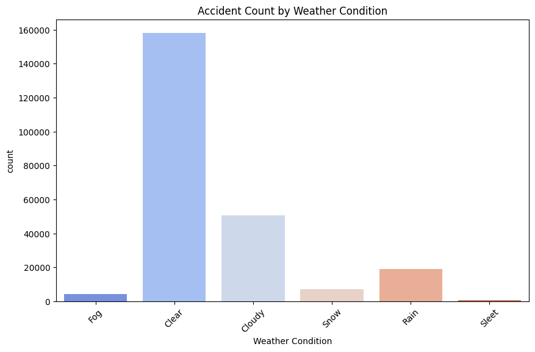
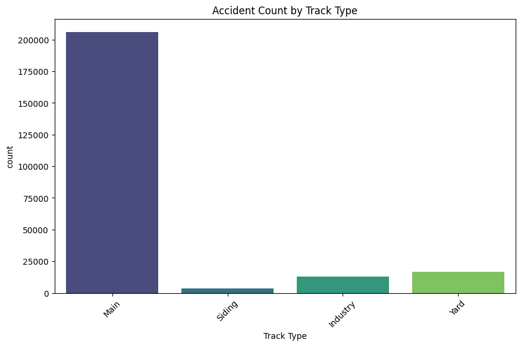
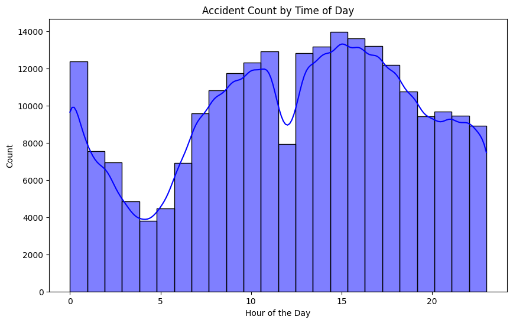
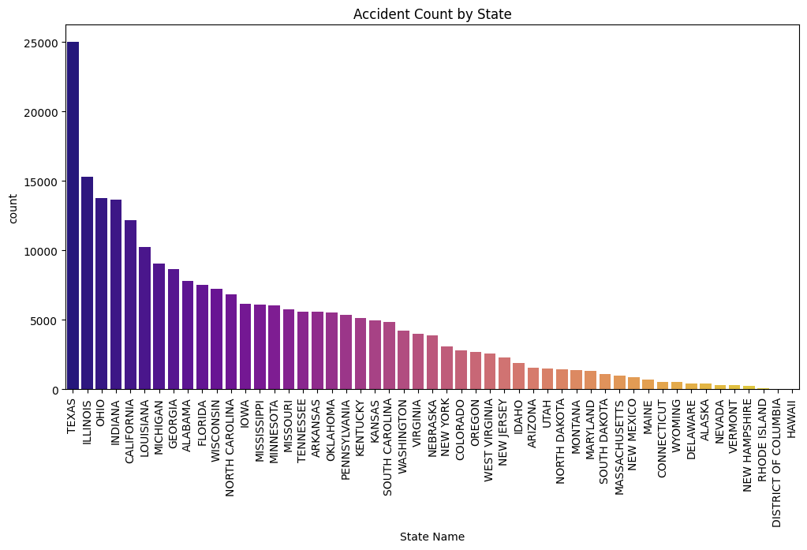
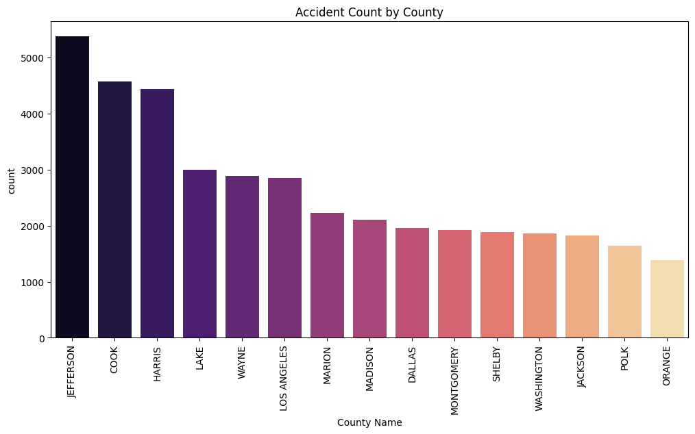

##  Railway Grade Crossing Accident Data Analysis

This repository contains a data analysis project focused on accidents at highway-rail grade crossings in the United States. Using visualizations, we uncover patterns based on weather, track type, time of day, and regional locations (state and county).

---

##  Dataset

**Filename**: `Highway-Rail_Grade_Crossing_Accident_Data.csv`  
The dataset includes accident reports from various crossings across the U.S., providing insights into environmental, temporal, and geographical factors.

---

## 📊 Visualizations

### 1. Accident Count by Weather Condition

---

### 2. Accident Count by Track Type

---

### 3. Accident Count by Time of Day

---

### 4. Accident Count by State

---

### 5. Top 15 Counties by Accident Count

---

## 🛠 Tools & Libraries Used

- Python 
- pandas 
- matplotlib 
- seaborn 

---
